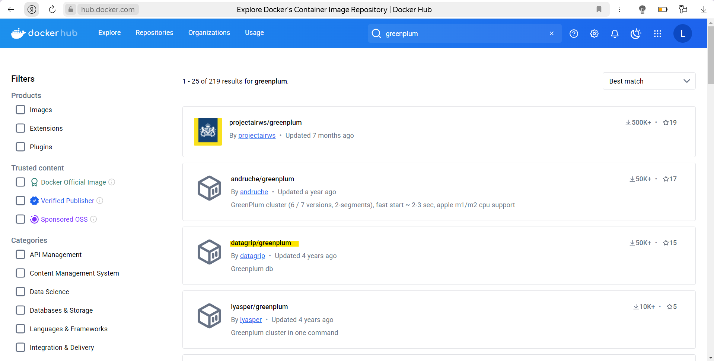
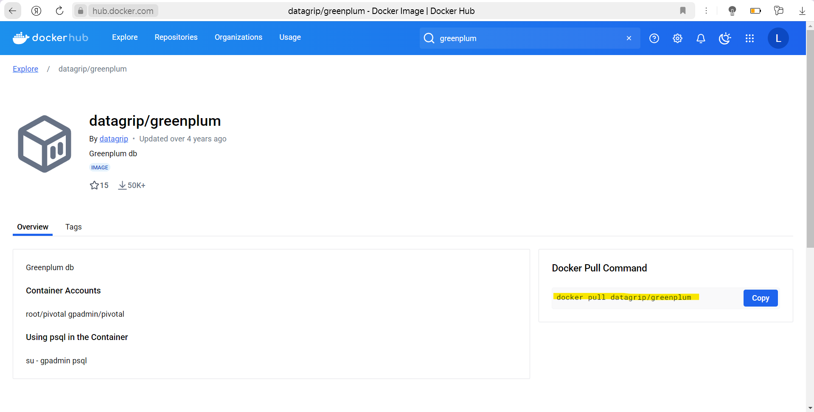
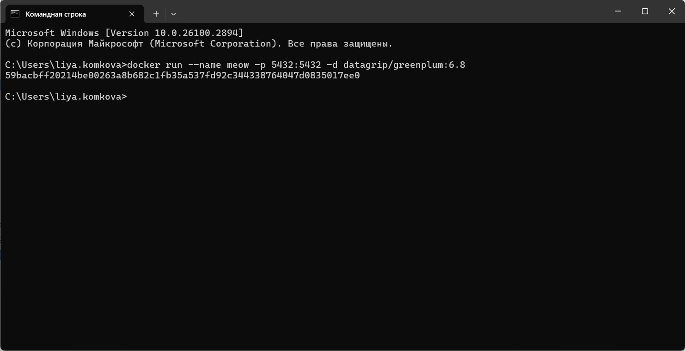
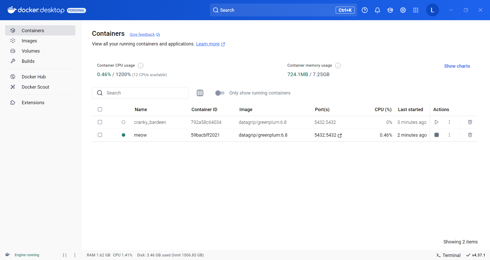

Как поднять у себя Greenplum

1. Скачать на оф. сайте Docker Desktop для Windows 10/11
2. Установить с обязательно включенной настройкой WSL 2, в остальном бездумно далее, регистрация необязательна
3. Найти любой Image (образ) Greenplum на сайте Docker Hub

4. Скачать найденный Image Greenplum, выполнив в терминале команду docker pull oBrAz\_GrEeNpLuM
5. Запустить Container, выполнив в терминале команду docker run --name iMyA\_c0nTeInErA -p 5432:5432 -d oBrAz\_GrEeNpLuM

6. Проверить, что контейнер запущен в Docker Desktop

7. Провалиться в контейнер, в Logs можно увидеть, с каким logopas подключаться к БД Greenplum в DBeaver, а можно не увидеть — тогда gpadmin gpadmin

8. Контейнер может не запуститься, тогда в логах же посмотреть и погуглить ошибку.

Запустить контейнер через вкладку Images, не оставлять поля портов пустыми, а прописав в них те же самые порты вручную.

Если занят порт, завершить процессы Postgresql в диспетчере задач. Либо в cmd пустить (п.5) на другой порт. Например, теперь docker run -- name nEmNoGo\_DrYgOe\_iMyA\_c0nTeInErA -p 5433:5433 -d oBrAz\_GrEeNpLuM

Если процессор не Intel или M, а AMD, то найти Image на Docker Hub (п.3) специально для него. Проверить процессор: Этот компьютер, Свойства, Система.
