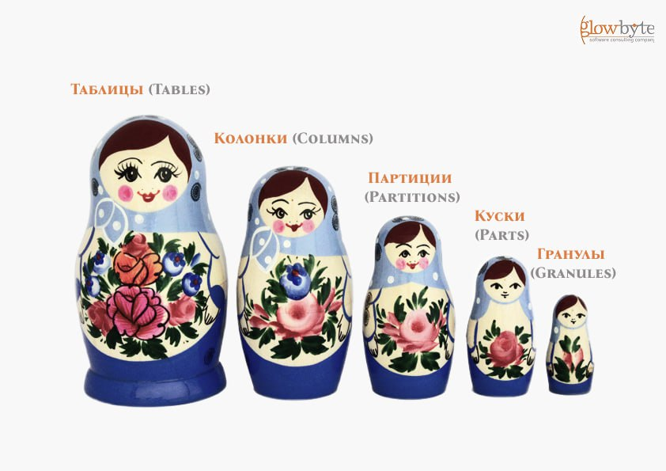
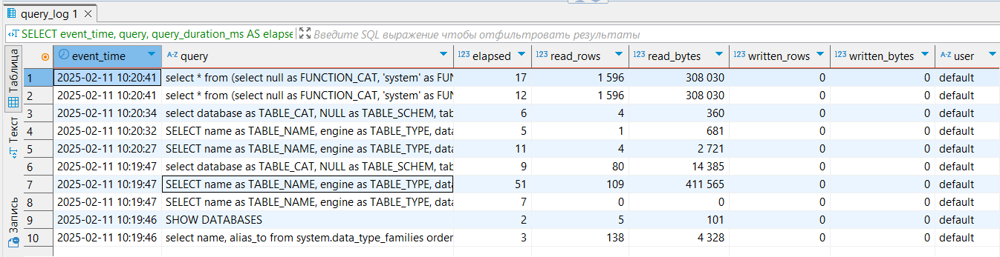

Работа с Clickhouse

ClickHouse — это высокопроизводительная столбцовая база данных, разработанная для онлайн-аналитической обработки запросов (OLAP). Она позволяет выполнять запросы к большим объемам данных с высокой скоростью, что делает её популярным выбором для различных задач анализа данных, в том числе задач реального времени.

Архитектура

1. Сервер: Основной компонент, обрабатывающий запросы и управляющий данными. Однонодовый ClickHouse может эффективно работать с таблицами, содержащими от сотен миллионов до триллионов строк и поддерживать тысячу одновременных подключений пользователей. Нужен многоядерный процессор для параллелизма, побольше оперативка и диски для начала 1-2 ТБ может быть достаточно.
1. SLB (Server Load Balancer): балансировщик нагрузки используется для равномерного распределения входящего трафика между несколькими узлами или серверами в кластере. 
1. Таблицы: Данные хранятся в колоночном формате на диске. Каждый столбец таблицы хранится в отдельном файле. Например, для таблицы с тремя столбцами будут созданы три файла, каждый из которых будет содержать данные для соответствующего столбца.
1. Мета-информация: Хранится в системных таблицах, которые находятся в памяти и на диске, обеспечивая доступ к структуре таблиц и их параметрам.
1. Реплики на разных серверах.
1. Дистрибуция данных: Данные можно распределить по нескольким серверам (шардам) для масштабируемости и повышения производительности.

Принципы отказоустойчивости высоконагруженной системы ClickHouse:

- каждый шард на отдельном хосте,
- у каждого шарда есть реплика,
- реплики созданы в отдельной зоне (например, в разных дата-центрах или географически удаленных регионах),
- настроено регулярное бэкапирование (полные или инкрементные резервные копии, которые создаются периодически, например, ежедневно или еженедельно). Резервные копии могут храниться в локальном, сетевом или облачном хранилище.

Особенности архитектуры

- Эффективность: ClickHouse хранит данные в формате столбцов, что обеспечивает высокую степень сжатия данных и уменьшает объем данных, необходимых для чтения с диска при выполнении запросов.
- ClickHouse использует различные алгоритмы сжатия для минимизации дискового пространства, требуемого для хранения данных:
  - LZ4: Быстрый алгоритм сжатия, обеспечивающий хорошую скорость и умеренное сжатие. Часто используется по умолчанию.
  - ZSTD (Zstandard): Алгоритм, который предлагает более высокую степень сжатия по сравнению с LZ4, при этом сохраняя хорошую скорость. Подходит для случаев, когда важна экономия места.
  - Delta: Используется для сжатия последовательных числовых данных, хранящих разности между значениями.
  - DoubleDelta: Улучшенная версия Delta, которая также учитывает разности между разностями.
  - Gzip: Алгоритм сжатия, который обеспечивает высокую степень сжатия, но может быть медленнее по сравнению с LZ4 и ZSTD.
  - LZMA: Алгоритм, обеспечивающий высокую степень сжатия, но с более низкой скоростью.
- Репликация и шардирование. Для обеспечения высокой доступности, кластеры могут масштабироваться горизонтально за счет распределения и реплицированы данных по нескольким узлам (шардам).
- Процессоры запросов ClickHouse оптимизированы для работы с векторными операциями, что позволяет обрабатывать данные быстрее, чем традиционные построчные операции.
- Асинхронная и параллельная обработка. ClickHouse может выполнять запросы, используя множество потоков, что значительно ускоряет обработку данных на серверах с многоядерными процессорами.
- Оптимизаторы запросов автоматически выбирают наиболее эффективные пути выполнения запросов, основываясь на статистике и структуре данных. При вставке данных в таблицы ClickHouse автоматически собирает статистику о новых данных, включая количество строк, размер данных и распределение значений, эта информация обновляется в системных таблицах. Это происходит постепенно, поэтому особенно после массовых изменений данных не грех вручную собрать статистику с помощью ANALYZE TABLE, в очереди планировщика забустится запрос обновления статистики для конкретной таблицы.
- Поддержка большинства стандартных SQL-операций и расширенных функций для работы с временными рядами, географическими данными и аналитическими запросами.

Форматы файлов

Данные организованы по столбцам, хранятся в виде таблиц, сегменты представляют собой физическую организацию этих таблиц на диске. Каждый сегмент может содержать:

- Файлы данных:
  - .bin: Это основной формат файлов, в которых хранятся данные столбцов. Например, при создании таблицы example\_table получатся файлы:
- id.bin — файл, содержащий данные для столбца id.
- name.bin — для столбца name.
- created\_at.bin — для столбца created\_at.
  - CREATE TABLE example\_table (

    `    `id UInt32,

    `    `name String,

    `    `created\_at DateTime

    ) ENGINE = MergeTree()

    ORDER BY id;

- Файлы индексов:
  - .idx: Файлы индексов, которые используются для быстрого доступа к данным. Например:
    - primary.idx — файл индекса для первичного ключа.
- Файлы метаданных:
  - .sql: Файлы, содержащие SQL-скрипты для создания таблиц и других объектов. Например:
    - metadata.sql — файл, содержащий метаданные о структуре таблицы.
- Файлы сжатия:
  - .mrk: Файлы, которые используются для хранения информации о сжатии данных. Например:
    - data.mrk — файл, содержащий информацию о сжатии для данных столбца.
- Файлы с агрегированными данными:
  - .agg: Файлы, содержащие агрегированные данные, если используется движок AggregatingMergeTree. Например:
    - aggregated\_data.agg — файл, содержащий агрегированные данные для определенной таблицы.
- Файл с метками для управления слиянием:
  - mark.0 
- Файл с контрольными суммами для проверки целостности данных:
  - checksums.txt

Данные хранятся в директории, которая обычно находится по пути /var/lib/clickhouse/data/, где каждая база данных и таблица имеют свои подкаталоги. Например, дефолтная бд:

/var/lib/clickhouse/data/default/example\_table/     ├── 2025-01-01\_0/

`    `│   ├── id.bin

`    `│   ├── name.bin

`    `│   ├── created\_at.bin

`    `│   ├── primary.idx

`    `│   └── data.mrk

`    `├── 2025-01-02\_1/

`    `│   ├── id.bin

`    `│   ├── name.bin

`    `│   ├── created\_at.bin

`    `│   ├── primary.idx

`    `│   └── data.mrk

`    `└── metadata/

`        `└── metadata.sql

Объекты

1. Базы данных (Databases): Контейнеры для таблиц.
1. Таблицы (Tables): Основные объекты для хранения данных.
1. Колонки (Columns) — это вертикальные структуры в таблице, которые содержат данные одного типа. Каждая колонка имеет свое имя и тип данных.
1. Партиции (Partitions) — это логические подмножества данных в таблице, которые позволяют разбивать данные на более управляемые части. Партицирование в основном задается по месяцам.
1. Куски (Parts) — это физические файлы, в которых хранятся данные партиций. Каждый кусок содержит информацию для определенного диапазона значений и может включать несколько файлов, типа, файлы с данными и индексами. В результате выполнения запросов куски объединяются в один для удаления дубликатов и упорядочивания данных с целью оптимизации хранения и повышения производительности запросов — этот процесс называется слиянием (merge).
1. Гранулы (Granules) — это еще более мелкие блоки хранения данных внутри кусков, которые могут загружаться в память, оптимизируя запросы, тоже обрабатываясь параллельно.

   

1. Представления (Views):
   1. Обычные: Виртуальные таблицы, обновляемые при каждом запросе.
   1. Материализованные: Хранят результаты запросов и обновляются автоматически.
1. Индексы (Indexes): Структуры для ускорения поиска данных. В ClickHouse все индексы разреженные: они не хранят информацию о каждой строке, а только о некоторых из них. Данные, которые не соответствуют условиям запроса, быстро пропускаются целыми блоками.
1. Функции (Functions): Встроенные или пользовательские функции для работы с данными.
1. Словари (Dictionaries): Структуры для быстрого доступа к внешним данным, могут использоваться для выполнения JOIN, помогая не загружать все данные в память.
1. Системные таблицы (System Tables): Метаданные о состоянии системы и объектах.
1. Кластерные таблицы (Distributed Tables): Таблицы, распределяющие данные по нескольким серверам.
1. Проекции (Projections): Предварительно рассчитанные структуры для оптимизации запросов. Пример:
1. CREATE TABLE example\_table (

   `    `id UInt32,

   `    `name String,

   `    `created\_at DateTime

   ) ENGINE = MergeTree()

   ORDER BY id

   PROJECTION example\_projection (

   `    `SELECT

   `        `count() AS count,

   `        `toStartOfMonth(created\_at) AS month

   `    `GROUP BY month

   );

2. ALTER TABLE example\_table ADD PROJECTION example\_projection (

   `    `SELECT

   `        `count() AS count,

   `        `toStartOfMonth(created\_at) AS month

   `    `GROUP BY month

   );

8. Внешние таблицы (External Tables): представляют собой механизм, который позволяет работать с данными, хранящимися вне ClickHouse, как если бы они были обычными таблицами. Это может быть полезно для временного хранения и анализа данных, загружаемых из внешних файлов или источников.

   Пример создания внешней таблицы:

   SELECT \*

   FROM file('data.csv', 'CSV', 'name String, age UInt32, salary UInt32') WHERE age > 30;

   В этом примере file — это функция, позволяющая читать данные непосредственно из файла data.csv. Формат файла указывается как CSV, потом перечисляются столбцы с их типами данных.

Основные способы оптимизации работы кластера: индексация, шардирование, партицирование и выбор правильного движка. Движки таблиц — это механизмы, определяющие, как данные будут храниться, обрабатываться и индексироваться в таблицах.

- MergeTree: Основное семейство движков, оптимизированных для операций вставки и выборки. Требует указания первичного ключа для эффективной сортировки и слияния данных.  
- [MergeTree](https://clickhouse.com/docs/ru/engines/table-engines/mergetree-family/mergetree#table_engines-mergetree): Основной табличный движок в ClickHouse, предназначенный для высокоэффективной работы с большими объёмами данных. Этот движок и его производные обеспечивают высокую производительность за счёт эффективного хранения данных в столбцах и использования механизмов слияния и сжатия данных. 

CREATE TABLE visits

(

`    `VisitDate Date,

`    `Hour UInt8,

`    `ClientID UUID

)

ENGINE = MergeTree()

PARTITION BY toYYYYMM(VisitDate)

ORDER BY Hour 

- ReplicatedMergeTree: Репликация поддерживается только для таблиц семейства MergeTree. Чтобы задать репликацию, необходимо указать параметры в конфигурационном файле, а также прописать параметры движка в SQL запросе в скобках.
- ReplacingMergeTree: Автоматически удаляет старые записи с одинаковым ключом при слиянии.
- SummingMergeTree: Подходит для агрегации числовых данных; автоматически суммирует значения при слиянии.
- AggregatingMergeTree: Предназначен для хранения промежуточных состояний агрегатных функций, что позволяет выполнять агрегацию данных на лету.
- CollapsingMergeTree: Позволяет автоматически удалять пары записей с инвертированными значениями специального столбца Sign при слиянии.
  - VersionedCollapsingMergeTree: Позволяет автоматически удалять пары записей с инвертированными значениями специального столбца Sign при слиянии.
- Log: Движки разработаны для быстрой записи данных без каких-либо оптимизаций на чтение или агрегацию. 
  - [StripeLog](https://clickhouse.com/docs/ru/engines/table-engines/log-family/stripelog): Подходит для журналирования данных, где каждая запись добавляется в конец файла.
  - [TinyLog](https://clickhouse.com/docs/ru/engines/table-engines/log-family/tinylog): Простой движок для малых таблиц, где операции чтения не требуют высокой производительности.
  - [Log](https://clickhouse.com/docs/ru/engines/table-engines/log-family/log): Обеспечивает баланс между производительностью записи и чтения, храня данные в последовательно записываемых файлах. Отличается от [TinyLog](https://clickhouse.com/docs/ru/engines/table-engines/log-family/tinylog) тем, что вместе с файлами столбцов лежит небольшой файл "засечек". Засечки пишутся на каждый блок данных и содержат смещение: с какого места нужно читать файл, чтобы пропустить заданное количество строк. Это позволяет читать данные из таблицы в несколько потоков. При конкурентном доступе к данным чтения могут выполняться одновременно, а записи блокируют чтения и друг друга. Движок Log не поддерживает индексы.
- Интеграционные: Предоставляют возможности интеграции с внешними системами и сервисами, позволяя ClickHouse работать непосредственно с данными из других источников.
  - [ODBC](https://clickhouse.com/docs/ru/engines/table-engines/integrations/odbc)
  - [JDBC](https://clickhouse.com/docs/ru/engines/table-engines/integrations/jdbc)
    - CREATE TABLE jdbc\_table (...) ENGINE = JDBC('jdbc:mysql://host:port/db', 'user', 'password', 'table')
  - [MySQL](https://clickhouse.com/docs/ru/engines/table-engines/integrations/mysql)
  - [MongoDB](https://clickhouse.com/docs/ru/engines/table-engines/integrations/mongodb)
  - [HDFS](https://clickhouse.com/docs/ru/engines/table-engines/integrations/hdfs)
    - CREATE TABLE hdfs\_table (...) ENGINE = HDFS('hdfs://namenode:port/path/to/file', 'Parquet')
  - [S3](https://clickhouse.com/docs/ru/engines/table-engines/integrations/s3)
  - [Kafka](https://clickhouse.com/docs/ru/engines/table-engines/integrations/kafka): для потоковой обработки данных. 
    - CREATE TABLE kafka\_table (name String, age UInt32) ENGINE = Kafka(...) SETTINGS ...
  - [EmbeddedRocksDB](https://clickhouse.com/docs/ru/engines/table-engines/integrations/embedded-rocksdb)
  - [RabbitMQ](https://clickhouse.com/docs/ru/engines/table-engines/integrations/rabbitmq)
  - [PostgreSQL](https://clickhouse.com/docs/ru/engines/table-engines/integrations/postgresql)
- Специальные: Предназначены для специализированных задач и уникальных сценариев использования. 
  - Distributed: Движок Distributed не хранит данные самостоятельно, а позволяет обрабатывать запросы распределенно на нескольких серверах. Чтобы распределённая таблица создавалась на каждом шарде, при создании нужно использовать опцию ON CLUSTER.
  - Dictionary: Основан на внешних словарях и используется для быстрого преобразования значений, например, замены кодов стран их названиями. Отображает данные словаря как таблицу ClickHouse.
  - Merge (не путать с движком MergeTree): не хранит данные самостоятельно, а позволяет читать одновременно из произвольного количества других таблиц. Чтение автоматически распараллеливается. Запись в таблицу не поддерживается. При чтении будут использованы индексы тех таблиц, из которых реально идёт чтение, если они существуют.
  - File: Позволяет работать с данными, хранящимися в файлах на диске в различных форматах (CSV, TSV и т.д.). Примеры применения:
    - Выгрузка данных из ClickHouse в файл.
    - Преобразование данных из одного формата в другой.
    - Обновление данных в ClickHouse редактированием файла на диске.
  - Null: При записи в таблицу типа Null, данные игнорируются. При чтении из таблицы типа Null, возвращается пустота.
  - Set: Представляет собой множество, постоянно находящееся в оперативке. Предназначен для использования в правой части оператора IN.
  - Join: Подготовленная структура данных для использования в операциях [JOIN](https://clickhouse.com/docs/ru/sql-reference/statements/select/join#select-join).
  - URL: Управляет данными на удаленном HTTP/HTTPS сервере. Похож на движок [File](https://clickhouse.com/docs/ru/engines/table-engines/special/file).
  - View: Используется для реализации представлений (CREATE VIEW). Не хранит данные, а хранит только указанный запрос SELECT. При чтении из таблицы, выполняет его (с удалением из запроса всех ненужных столбцов).
  - MaterializedView: Используется для реализации материализованных представлений (CREATE VIEW). Для хранения данных использует другой движок, который был указан при создании представления. Этот движок используется при чтении из таблицы.
- Memory: Данные полностью хранятся в оперативной памяти, что обеспечивает максимальную скорость чтения и записи. Предназначен для использования в правой части оператора IN для реализации GLOBAL IN.
- Buffer: Буферизует записываемые данные в оперативке, периодически сбрасывая их в другую таблицу. При чтении, производится чтение данных одновременно из буфера и из другой таблицы.

`  `Синтаксис UPDATE и DELETE в ClickHouse не поддерживается. Механизмы, позволяющие выполнять операции обновления и удаления строк в таблицах, называются мутациями.

- ALTER TABLE имя\_таблицы UPDATE column\_name = новое\_значение WHERE условие; -- обновление строк
- ALTER TABLE имя\_таблицы DELETE WHERE условие; -- удаление строк

При мутации создается новая версия данных, а старая версия помечается для удаления, но фактически данные не удаляются до следующего процесса слияния (merge). Статус мутаций можно отслеживать через системные таблицы:

1. system.mutations: информация о всех мутациях, которые были инициированы, включая их статус, время начала и завершения, а также количество затронутых строк.
1. system.parts: информация о частях таблиц, включая статус мутаций для каждой части, что позволяет отслеживать, какие части данных были изменены.

Благодаря своей архитектуре ClickHouse выдает результаты за несколько секунд, только не всегда сразу правильные, потому что использует разные модели согласованности:

- Eventual Consistency (конечная согласованность): используется в распределенных системах, где данные могут быть временно несогласованными, но в конечном итоге все копии данных станут согласованными. Она не гарантирует, что все операции чтения будут возвращать последние записанные данные в любой момент времени.
- Causal consistency (причинная согласованность): не требует, чтобы все процессы видели одну и ту же последовательность записей в памяти. Операции, имеющие причинно-следственную связь, будут идти последовательно, зато операции, не связанные друг с другом, могут выполняться параллельно.
- Sequential consistency: все операции выполняются последовательно.
- Linearizable: все операции (чтения и записи) видны всем пользователям в одном и том же порядке, т.е. если одна операция завершилась, то все последующие операции будут видеть результат этой операции. Это наиболее строгая модель согласованности, которой можно достичь в ClickHouse. Для нее нужно реализовать механизм кворумной вставки: используются параметры replicated таблиц, кворум настраивается на уровне реплик. Количество узлов в кворуме должно равняться количеству реплик. 

TTL (Time to Live) — это механизм, позволяющий автоматически удалять или изменять данные на основе времени их хранения. Может применяться к таблицам, отдельным столбцам и партициям, и их частям (parts), но не к представлениям (views).

` `Оператор ORDER BY играет ключевую роль в оптимизации запросов и производительности. При создании таблицы с движком MergeTree и его производными, ORDER BY указывает, как данные будут упорядочены на диске. Это влияет на эффективность выполнения запросов, особенно при фильтрации и агрегации. Синтаксис ORDER BY в запросах выглядит следующим образом:

`        `SELECT \* FROM table\_name

`        `ORDER BY column1, column2;

Часто ORDER BY используется вместе с LIMIT, чтобы получить только определенное количество строк в заданном порядке:

`        `SELECT \* FROM table\_name

`        `ORDER BY column1 DESC

`        `LIMIT 10;

В ClickHouse при соединении таблиц нужно учитывать специфику. Выполняя JOIN ClickHouse всегда старается всю таблицу запихнуть в оперативку. Касаемо синтаксиса, доступны все стандартные соединения, и есть дополнительные: SEMI, ANTI (типа, чс создает) и ANY помогают выполнять отбор быстрее, чем через декартово произведение. INNER и FULL - отключают полностью декартово произведение, LEFT и RIGHT - отключают частично. 

1. ANY INNER JOIN: Возвращает одну произвольную строку из правой таблицы для каждой строки из левой таблицы, если есть совпадение. Пример:
1. SELECT a.id, a.name, b.amount

   FROM users AS a

   ANY INNER JOIN orders AS b ON a.id = b.user\_id;

2. Результат: Вернет пользователей с произвольным заказом, если у них есть заказы.
2. Как выполняется: ClickHouse выбирает одну строку из правой таблицы для каждой строки из левой, что может быть более производительным, чем обычный INNER JOIN.
2. ANY LEFT JOIN: Похож на LEFT JOIN, но возвращает одну произвольную строку из правой таблицы. Пример:
1. SELECT a.id, a.name, b.amount

   FROM users AS a

   ANY LEFT JOIN orders AS b ON a.id = b.user\_id;

2. Результат: Вернет всех пользователей, включая тех, у кого нет заказов, с произвольным значением amount.
2. Как выполняется: ClickHouse выбирает одну строку из правой таблицы для каждой строки из левой, добавляя NULL для отсутствующих значений.
3. SEMI JOIN: Возвращает строки из левой таблицы, для которых есть совпадения в правой таблице, но не возвращает столбцы из правой таблицы. Пример:
1. SELECT a.id, a.name

   FROM users AS a

   SEMI JOIN orders AS b ON a.id = b.user\_id;

2. Результат: Вернет только пользователей, у которых есть заказы.
2. Как выполняется: ClickHouse проверяет наличие совпадений в правой таблице, но не извлекает данные из нее.
4. ANTI JOIN: Возвращает строки из левой таблицы, для которых нет совпадений в правой таблице. Пример:
1. SELECT a.id, a.name

   FROM users AS a

   ANTI JOIN orders AS b ON [a.id](http://a.id) = b.user\_id;

2. Результат: Вернет пользователей, у которых нет заказов. Аналогичен способу LEFT JOIN ... WITH ... IS NULL, но эффективнее.
2. Как выполняется: ClickHouse проверяет отсутствие совпадений в правой таблице и возвращает только те строки из левой таблицы, которые не имеют соответствий, не используя декартово произведение.

` `В ClickHouse важен порядок соединения таблиц: нужно сначала указывать меньшую таблицу. Это может влиять на производительность запросов.

Алгоритмы соединений: 

- Hash Join — стандартное хэширование.
- Partial Merge Join — слияние сортированных списков используется, когда обе таблицы отсортированы по ключу соединения, что позволяет эффективно находить соответствия
- Prefer Partial Merge Join — слияние сортированных списков, когда это возможно. Т.е. если данные не отсортированы, он может переключиться на Hash Join.
- Auto выставляется, чтобы у ClickHouse была возможность заменить Hash Join на Partial Merge Join или Prefer Partial Merge Join в зависимости от условий выполнения запроса, чтобы избежать переполнения доступной памяти.
- Еще есть распределенный join: данные улетают на другие шарды и возвращаются назад. Принцип действия, как при replicated в GreenPlum.

Ролевая модель

- Пользователи: создаются с различными правами доступа.
- Группы: пользователей объединяют в группы, чтобы на них назначать общие привилегии.
- Привилегии: определяют, какие действия могут выполнять пользователи или роли (например, SELECT, INSERT, ALTER и т.д.).
- Роли: создаются для группировки привилегий, которые затем назначаются пользователям.

CREATE USER username IDENTIFIED WITH plaintext\_password BY 'password'; -- Создание пользователя GRANT SELECT ON database.table TO username; -- Назначение роли

CREATE ROLE role\_name; -- Создание роли

GRANT SELECT, INSERT ON database\_name.\* TO role\_name; -- Выдача привилегий роли GRANT role\_name TO username; -- Назначение роли пользователю

REVOKE role\_name FROM username; -- Отбирание роли у пользователя

SHOW GRANTS FOR username; -- Проверить, какие привилегии у пользователя или роли

Квоты (Quotas) - Глобальные ограничения на использование ресурсов, применяемые на уровне пользователя или группы пользователей на определенный период (например, максимальный объем хранимых данных, количество запросов).

Зачем: Управление распределением ресурсов между пользователями, предотвращение злоупотреблений и планирование потребностей в ресурсах.

Ограничения (Limits) - Правила, устанавливающие пределы использования ресурсов на уровне одного запроса или сессии (например, максимальное время выполнения запроса, количество возвращаемых строк).

Зачем: Защита от перегрузки системы, управление производительностью и предотвращение исчерпания ресурсов одним запросом.

- SET max\_execution\_time = 2000; -- Установка лимита на 2 секунды SELECT \*

  FROM my\_table

  WHERE some\_column = 'some\_value';

- SET max\_memory\_usage = 100000000; -- Установка лимита на 100 МБ SELECT \*

  FROM my\_table;

Мониторинг и анализ работы сервера осуществляется при помощи SQL запросов с выбором нужных метрик к широким во всех смыслах системн ым таблицам. 

- system.parts содержит информацию о частях (кусках, parts) таблиц. Каждая таблица разбивается на части для оптимизации хранения и обработки данных. На что обращать внимание:
  - database и table: Имя базы данных и таблицы, к которой относится часть.
  - active: Указывает, активна ли часть. Это важно для понимания, какие части в данный момент используются.
  - data\_compressed\_bytes и data\_uncompressed\_bytes: Размеры сжатых и несжатых данных. Это помогает оценить эффективность сжатия и использование дискового пространства.
  - marks\_bytes: Размер меток, которые используются для индексации данных. Это может помочь в оценке производительности запросов.
- system.processes содержит информацию о текущих выполняемых запросах на сервере ClickHouse. На что обращать внимание:
  - query: Текст выполняемого запроса. Это полезно для отладки и анализа производительности.
  - elapsed: Время выполнения запроса. Это помогает выявить долгие запросы, которые могут негативно влиять на производительность.
  - read\_rows и written\_rows: Количество строк, прочитанных и записанных в процессе выполнения запроса. Это может помочь в оценке нагрузки на систему.
  - user: Имя пользователя, который выполняет запрос. Это может быть полезно для аудита и мониторинга активности пользователей.
- system.metrics содержит различные метрики, связанные с производительностью и состоянием сервера. На что обращать внимание:
  - TotalRows: Общее количество строк в базе данных. Это может помочь в оценке объема данных.
  - TotalQueries: Общее количество выполненных запросов. Это может помочь в оценке нагрузки на сервер.
  - MemoryUsage: Использование памяти сервером. Это важно для мониторинга ресурсов и предотвращения перегрузки.
  - ActiveConnections: Количество активных соединений. Это может помочь в оценке нагрузки на сервер и управлении ресурсами.
- system.query\_log содержит информацию о выполненных запросах к серверу. Она используется для мониторинга и анализа производительности запросов. Основные поля:
  - event\_time: Время, когда запрос был выполнен.
  - query: Текст выполненного SQL-запроса.
  - query\_duration\_ms: Время выполнения запроса в миллисекундах.
  - read\_rows: Количество строк, прочитанных во время выполнения запроса.
  - read\_bytes: Объем данных, прочитанных во время выполнения запроса (в байтах).
  - written\_rows: Количество строк, записанных в результате выполнения запроса.
  - written\_bytes: Объем данных, записанных в результате выполнения запроса (в байтах).
  - user: Имя пользователя, который выполнил запрос.
  - client\_address: IP-адрес клиента, который отправил запрос.
  - client\_port: Порт клиента.
  - http\_method: HTTP-метод, использованный для запроса (например, GET или POST).
  - exception\_code: Код ошибки, если запрос завершился с ошибкой.
  - exception: Сообщение об ошибке, если запрос завершился с ошибкой.
  - type: Тип события (например, QueryStart, QueryFinish, Exception и т.д.).

    SELECT 

    `    `event\_time, 

    `    `query, 

    `    `query\_duration\_ms AS elapsed,  

    `    `read\_rows, 

    `    `read\_bytes, 

    `    `written\_rows, 

    `    `written\_bytes, 

    `    `user 

    FROM system.query\_log

    WHERE type = 'QueryFinish'  -- Фильтруем только завершенные запросы

    ORDER BY event\_time DESC

    LIMIT 10;  -- Ограничиваем результат последними 10 запросами

    

Параметр cpu\_time\_ms точно можно найти в ClickHouse от Яндекса. В ванильном, вероятно, можно добавить его в конфигурационных файлах самостоятельно. 

Инструменты визуализации и мониторинга: метрики работы ClickHouse в реальном времени собирает Prometheus, с которым интегрируется Grafana для создания дашбордов.

Механизм spill происходит, когда ClickHouse не может разместить в оперативной памяти все данные, необходимые для выполнения запроса, и они начинают записываться на диск. Если система не может выполнить spill, запрос завершится с ошибкой, указывающей на нехватку памяти. В таком случае ClickHouse удалит spill-файлы, связанные с этим запросом, освобождая место на диске.

Обновления ClickHouse следует проводить регулярно для обеспечения безопасности и использования последних функций. Обновление можно выполнить стандартными командами системы управления пакетами:

sudo apt-get update

sudo apt-get upgrade clickhouse-server clickhouse-client

Типы данных

1. Примитивные типы
   1. Числовые типы: Int8, Int16, Int32, Int64, UInt8, UInt16, UInt32, UInt64, Float32, Float64.
   1. Логический тип: Bool.
1. Строковые типы
1. Строка: String — строка байт переменной длины.
   1. В столбце типа String можно хранить JSON-объекты: CREATE TABLE example (id UInt32, json\_data String) ENGINE = MergeTree() ORDER BY id; 
1. FixedString(N): Строка фиксированной длины N.
3. Дата и время
   1. Дата: Date — хранит дату (без времени).
   1. Дата-время: DateTime — хранит дату и время, поддерживает различные часовые пояса с
   1. DateTime('timezone').
3. Сложные типы
   1. Массивы: Array(T) — массив элементов типа T.
   1. Кортежи: Tuple(T1, T2, ...) — фиксированная комбинация элементов разных типов.
   1. Словари: Map(K, V) — коллекция ключ-значение.
3. Специализированные типы
1. IP-адреса: IPv4 и IPv6.
1. Enum: Перечисления, которые являются строками или числами с фиксированным набором значений.

Вариант интеграции Kafka с ClickHouse

1. Использование Kafka Engine в ClickHouse. Пишется специализированный DDL запрос.

a.  -- Эта таблица будет читать данные из Kafka топика my\_topic в формате JSON.

CREATE TABLE kafka\_table (     topic\_name String,

`    `partition\_id Int32,

`    `offset UInt64,

`    `key String,

`    `value String,

`    `timestamp DateTime

) ENGINE = Kafka()

SETTINGS kafka\_broker\_list = 'kafka-broker:9092',          kafka\_topic\_list = 'my\_topic',

`         `kafka\_group\_name = 'clickhouse\_group',

`         `kafka\_format = 'JSONEachRow';

2. Использование внешних консюмеров, написанных на Python, Java или Go, и настроенных для отправки в ClickHouse через HTTP интерфейс или JDBC/ODBC драйверы. 

a.  Пример такой интеграции на Python:

from confluent\_kafka import Consumer import requests

- Настройка консьюмера Kafka

  conf = {'bootstrap.servers': "kafka-broker:9092",         '[group.id](http://group.id)': "clickhouse\_group",

  `        `'auto.offset.reset': 'earliest'}

  consumer = Consumer(conf) consumer.subscribe(['my\_topic'])

- Чтение и отправка данных в ClickHouse

  while True:

  `    `msg = consumer.poll(1.0)

  `    `if msg is None:

  `        `continue

  `    `if msg.error():

  `        `print("Consumer error: {}".format(msg.error()))

  `        `continue

  `    `data = msg.value().decode('utf-8')

  `    `requests.post('http://clickhouse-server:8123/', data=data)

  consumer.close()
